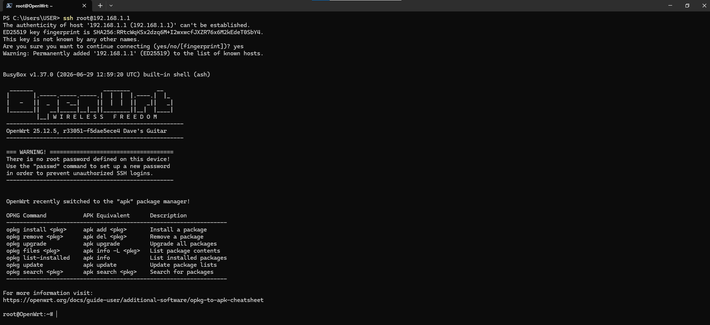
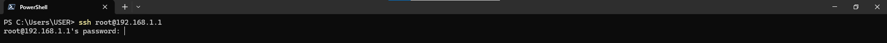
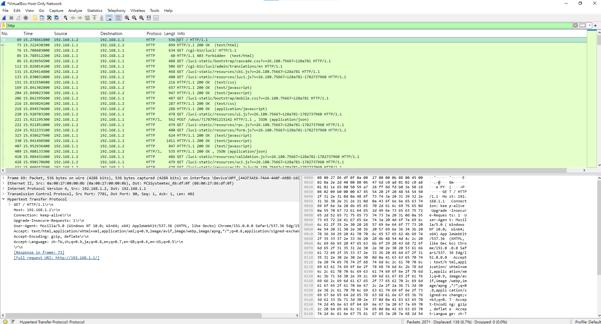
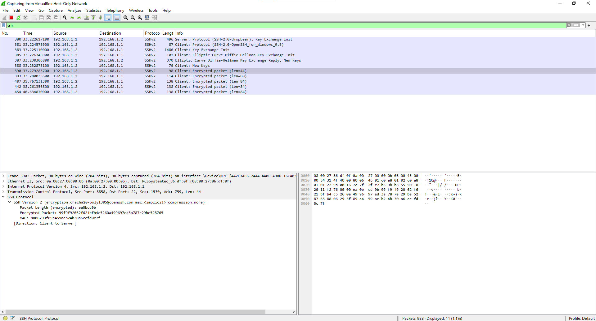
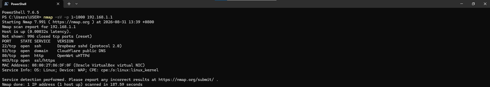
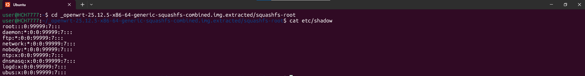

# OpenWrt 25.12.5 Security Evaluation & Hardening Report

> **Disclaimer & Assessment Scope Limit**: This project evaluates selected technical security controls mapped to **IEC 62443-4-2** standards and follows structured documentation principles informed by **ISO/IEC 17025**. This report represents a technical proof-of-concept (PoC) evaluation of specific requirements and does not constitute a full conformity assessment or commercial product certification.

---

## 📋 Evaluation Overview

| Parameter | Details |
| :--- | :--- |
| **Target of Evaluation (TOE)** | OpenWrt 25.12.5 (`r33051-f5dae5ece4`, x86/64) |
| **Package Manager** | Alpine Package Keeper (`apk`) |
| **Standard Mapping** | IEC 62443-4-2 (Selected Technical Requirements) |
| **Documentation Approach** | Practices informed by ISO/IEC 17025 Laboratory Principles |
| **Attacker Host** | Kali Linux (`192.168.1.100`) |
| **Target Host** | OpenWrt Gateway (`192.168.1.1`) |
| **Evaluation Verdict** | **4/4 Selected Test Cases PASS (Post-Remediation)** |

---

## 🛠️ Security Toolchain

* **Network Scanning & Enumeration**: Nmap v7.95
* **Traffic Analysis & Inspection**: Wireshark v4.2.0
* **Firmware Analysis & Static Audit**: Binwalk v2.3.3, SquashFS-tools
* **Access Control & Inspection CLI**: OpenSSH CLI, Curl

---

## 📊 Compliance & Test Case Summary

| Test ID | Mapped Requirement | Description | Pre-Remediation | Post-Remediation | Action & Verification |
| :---: | :--- | :--- | :---: | :---: | :--- |
| **TC-CR1.1-01** | **CR 1.1** | Human User Identification & Authentication | ❌ **FAIL** | ✅ **PASS** | Set root password; disabled unauthenticated and empty-password logins via UCI. |
| **TC-CR3.1-01** | **CR 3.1** | Secure Web Communication & Credential Protection | ❌ **FAIL** | ✅ **PASS** | Installed `luci-ssl` via `apk`; configured HTTP-to-HTTPS (TLS) redirect via uHTTPd. |
| **TC-NET-01** | **Attack Surface Baseline** | Network Attack Surface Assessment (Supporting CR 7.1) | ✅ **PASS** | ✅ **PASS** | Enumerated open TCP ports (22, 53, 80, 443); verified minimal service exposure. |
| **TC-FIRM-01** | **FIRM-01** | Firmware Static Credentials Audit | ✅ **PASS** | ✅ **PASS** | Extracted rootfs via Binwalk; verified `/etc/shadow` contains no hardcoded password hashes. |

---

## 🔍 ISO/IEC 17025 Structured Test Cases

### 1. [TC-CR1.1-01] Human User Identification & Authentication

* **Requirement**: IEC 62443-4-2 CR 1.1 — Human user identification and authentication.
* **Objective**: Verify that access to management interfaces (SSH/LuCI) requires explicit user authentication and blocks unauthenticated access.
* **Preconditions**: OpenWrt 25.12.5 factory default configuration.

#### Initial Evaluation (Fail)
* **Procedure**: Attempt unauthenticated SSH connection to the target device.
  ```bash
  ssh root@192.168.1.1
  ```
* **Observed Result**: Granted immediate `root` shell access without requesting a password.



#### Remediation & Hardening
* **Procedure**: Set `root` account password and enforce Dropbear authentication policies via UCI.
  ```bash
  # 1. Set root account password
  passwd

  # 2. Configure Dropbear SSH service via UCI
  uci set dropbear.@dropbear[0].PasswordAuth='on'
  uci set dropbear.@dropbear[0].RootPasswordAuth='on'
  uci set dropbear.@dropbear[0].EmptyPasswd='0'
  uci commit dropbear
  /etc/init.d/dropbear restart
  ```

#### Re-test Verification (Pass)
* **Procedure**: Re-execute SSH login attempt from the attacker host.
  ```bash
  ssh root@192.168.1.1
  ```
* **Observed Result**: Direct unauthenticated login rejected. System prompts for user credential password (`root@192.168.1.1's password:`).



---

### 2. [TC-CR3.1-01] Secure Web Communication & Credential Protection

* **Requirement**: IEC 62443-4-2 CR 3.1 — Communication integrity and confidentiality.
* **Objective**: Ensure web management traffic (LuCI) is protected against plaintext eavesdropping through encrypted HTTPS/TLS communication.
* **Preconditions**: Default LuCI Web interface operating over unencrypted HTTP (Port 80).

#### Initial Evaluation (Fail)
* **Procedure**: Intercept LuCI login traffic on Port 80 using Wireshark.
* **Observed Result**: Plaintext HTTP POST request captured containing sensitive authentication parameters (`luci_username` and `luci_password`).



#### Remediation & Hardening
* **Procedure**: Install SSL module using OpenWrt 25.12 `apk` syntax and enable HTTP-to-HTTPS redirection in uHTTPd.
  ```bash
  # 1. Update package repository and install HTTPS support
  apk update
  apk add luci-ssl

  # 2. Enforce HTTP-to-HTTPS redirect via UCI
  uci set uhttpd.main.redirect_https='1'
  uci commit uhttpd
  /etc/init.d/uhttpd restart
  ```

#### Re-test Verification (Pass)
* **Procedure**: Intercept network traffic during Web login access and verify TLS redirection.
* **Observed Result**: HTTP requests to Port 80 are redirected (`301 Moved Permanently`) to HTTPS Port 443. Traffic inspection confirms encrypted TLS communication and prevents credential exposure.



---

### 3. [TC-NET-01] Network Attack Surface Assessment

* **Requirement**: Supporting evidence for Attack Surface Reduction / Baseline Enumeration (IEC 62443-4-2 CR 7.1 context).
* **Objective**: Scan network ports (1-1000) to enumerate exposed network services and verify minimal attack surface exposure.
* **Preconditions**: Target host reachable at `192.168.1.1`.

#### Evaluation & Audit Procedure
* **Command**:
  ```bash
  nmap -sV -p 1-1000 192.168.1.1
  ```
* **Observed Result (Pass)**:
  Enumerated 4 expected active TCP services:
  * `22/tcp` — open (Dropbear SSH 2.0)
  * `53/tcp` — open (dnsmasq / Cloudflare public DNS proxy)
  * `80/tcp` — open (OpenWrt uHTTPd HTTP)
  * `443/tcp` — open (OpenWrt uHTTPd HTTPS / SSL)
  
  No unintended background ports or unverified services were identified within the scanned port range.



---

### 4. [TC-FIRM-01] Firmware Static File System Audit

* **Requirement**: Firmware Integrity & Default Credential Static Audit.
* **Objective**: Unpack the firmware image and inspect `/etc/shadow` for hardcoded password hashes or default credentials.
* **Preconditions**: Target firmware image `openwrt-25.12.5-x86-64-generic-squashfs-combined.img.gz`.

#### Evaluation & Audit Procedure
* **Command**:
  ```bash
  binwalk -e --rm openwrt-25.12.5-x86-64-generic-squashfs-combined.img.gz
  cd _openwrt-25.12.5-x86-64-generic-squashfs-combined.img.extracted/squashfs-root/
  cat etc/shadow
  ```
* **Observed Result (Pass)**:
  `cat etc/shadow` output confirmed the `root` account entry contains no pre-baked password hash (`root:::0:99999:7:::`), verifying that the default firmware filesystem image does not ship with hardcoded shadow credentials.



---

## 🇪🇺 Regulatory Context & CRA Alignment

This project is primarily mapped to selected **IEC 62443-4-2** technical requirements.

The testing and hardening activities evaluated in this report are also highly relevant to product cybersecurity practices associated with the **EU Cyber Resilience Act (CRA)**, particularly in key domain areas:
* **Authentication & Access Control**: Verifying secure default credentials and enforcing authentication controls.
* **Secure Communications**: Preventing cleartext eavesdropping by enforcing encrypted transport channels.
* **Attack Surface Reduction**: Auditing active services and maintaining a minimal exposed attack surface.
* **Vulnerability & Firmware Analysis**: Conducting static audits on firmware images to prevent static credential disclosure.

> **Note**: This mapping is provided strictly for technical learning and portfolio demonstration purposes. It does not constitute a formal CRA conformity assessment or legal compliance claim.

---

## 📁 Repository Structure

```text
.
├── README.md                     # Technical Evaluation & Hardening Report
└── images/                       # Evidential screenshots matching test cases
    ├── CR1.1_01_Fail.png
    ├── CR1.1_02_Pass.png
    ├── CR3.1_01_Fail.png
    ├── CR3.1_02_Pass.png
    ├── CR7.1_01_PortScan.png
    └── FIRM01_01_Binwalk_Analysis.png
```
